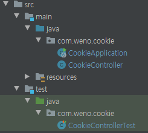
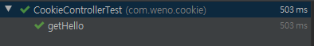
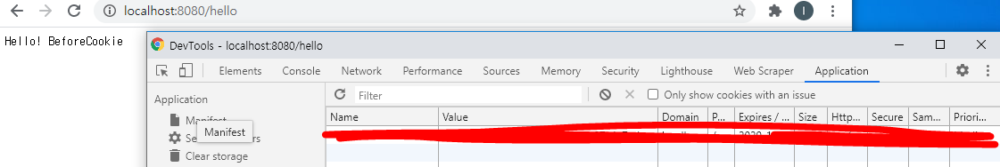
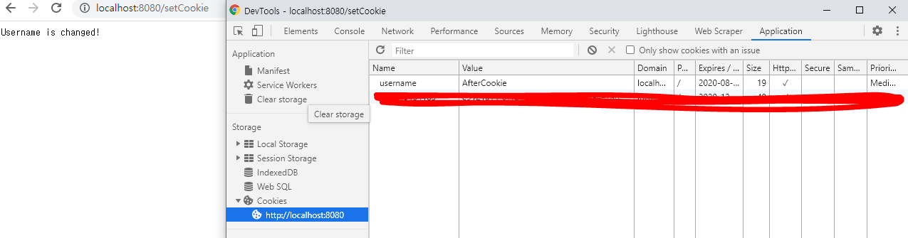
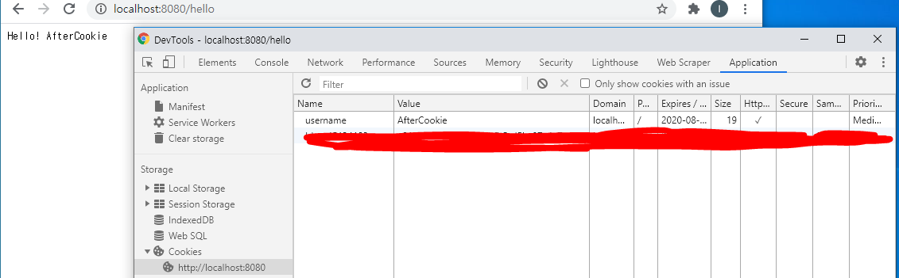
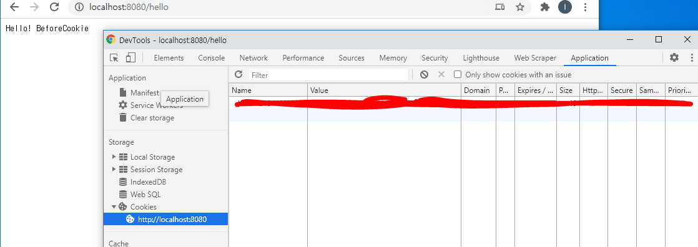

# Springboot Cookie 사용

## 쿠키란?
- 사용자의 부라우저에 저장되는 작은양의 정보이다.
- Http  cookie, Web cookie, Browser cookie 불린다.
- 크롱을 사용중이라면 개발자도구의 Application  탭에서 확인할 수 있다.
(아래의 글에서 확인할 수 있다.)
- 자세한 내용은 정리를 잘 해주신 라이언 서버님의 블로그(https://interconnection.tistory.com/7) 에서 확인 할 수 있습니다.


##  SpringBoot에서 Cookie 사용 방법

우선 spring initializr(https://start.spring.io/) 에서 프로젝트를 만들어 줍니다.
- build.gradle
```
plugins {
	id 'org.springframework.boot' version '2.3.3.RELEASE'
	id 'io.spring.dependency-management' version '1.0.10.RELEASE'
	id 'java'
}

group = 'com.weno'
version = '0.0.1-SNAPSHOT'
sourceCompatibility = '11'

configurations {
	compileOnly {
		extendsFrom annotationProcessor
	}
}

repositories {
	mavenCentral()
}

dependencies {
	implementation 'org.springframework.boot:spring-boot-starter-web'
	testImplementation('org.springframework.boot:spring-boot-starter-test') {
		exclude group: 'org.junit.vintage', module: 'junit-vintage-engine'
	}
	implementation 'junit:junit:4.12'
}

test {
	useJUnitPlatform()
}

```
- 프로젝트 구조   



- CookieContoller
```
import org.springframework.web.bind.annotation.CookieValue;
import org.springframework.web.bind.annotation.GetMapping;
import org.springframework.web.bind.annotation.RestController;

@RestController
public class CookieController {

    @GetMapping("/hello")
    public String checkCookie(@CookieValue(value = "username", defaultValue = "BeforeCookie") String username){
        return "Hello! My name is : " + username;
    }
}
```

- @CookieValue Annotation을 이용해서 쿠키 캆을 받아온다
- @CookieValue의 value는 매개변수인 String username에 값을 넣어준다.
- @CookieValue의 defaultValue는 Cookie값이 없을 때 설정되는 값이다.
- 실행화면


-CookieControllerTest
```
import org.junit.Test;
import org.junit.runner.RunWith;
import org.springframework.beans.factory.annotation.Autowired;
import org.springframework.boot.test.autoconfigure.web.servlet.WebMvcTest;
import org.springframework.test.context.junit4.SpringRunner;
import org.springframework.test.web.servlet.MockMvc;

import static org.springframework.test.web.servlet.request.MockMvcRequestBuilders.get;
import static org.springframework.test.web.servlet.result.MockMvcResultMatchers.status;

@RunWith(SpringRunner.class)
@WebMvcTest(CookieController.class)
public class CookieControllerTest {

    @Autowired
    private MockMvc mvc;

    @Test
    public void getHello() throws Exception {
        mvc.perform(get("/hello"))
                .andExpect(status().isOk());
    }
}
```

- Mockito를 이용하여 test코드를 작성하였습니다.
- 위의 코드는 쿠키와는 관련이 없는 코드이니 생략이 가능합니다.
- 실행화면




이렇게 하면 쿠키를 테스트하기 위한 사전작업이 끝났습니다. (배보다 배꼽이 더 큰것같은 기분..)

먼저 CookieContoller에 setCookie Method를 아래와 같이 생성해줍니다. 
(내용이 길어지는 관계로 테스트 코드에 대한 설명은 생략하겠습니다.)
```
    @GetMapping("/setCookie")
    public String setCookie(HttpServletResponse response){

        //create a cookie
        Cookie cookie = new Cookie("username", "AfterCookie");

        //set cookie expiration
        cookie.setMaxAge(10); // expires in 10 seconds

        //set secure
        cookie.setSecure(true); //https만 가능

        //set HttpOnly
        cookie.setHttpOnly(true); // prevent cross-site scripting (XSS) attacks

        //add cookie to response
        response.addCookie(cookie);

        return "Username is changed!";
    }
```

코드설명
- Cookie cookie = new Cookie("username", "AfterCookie")  
쿠키 생성

- cookie.setMaxAge(10)  
쿠키의 지속시간을 설정해줍니다. 괄호안의 시간 단위는 초입니다. 위의 코드의 경우 10초간 쿠키가 유지 됩니다.

- cookie.setSecure(true)   
보안을 위해 https로 접속한 경우에만 쿠키를 생성할 경우 setSecure의 값을 true로 설정해주면 됩니다.

-  cookie.setHttpOnly(true)   
XSS 공격으로 부터 보호하는 코드입니다.

- response.addCookie(cookie)      
HttpServletResponse객체에 cookie값을 설정하여 브라우저에게 전달합니다.


cookie.setSecure(true)를 주석처리하고 실행을하게 되면 개발자도구의 Application탭에 쿠키 값이 10초간 유지 되는 걸 확인하실수 있습니다.

1. logcalhost:8080/hello 접속



2. localhost:8080/setCookie 접속 및 개발자도구의 Application탭 확인
(쿠키가 생성된걸 확인할 수 있습니다.)



3. logcalhost:8080/hello 다시 접속하면 텍스트가 바뀐걸 확인 할 수 있습니다.



4. 그리고 10초가 지나고 새로고침을 하게 되면 쿠키가 없어져 텍스트 값이 원래대로 돌아간걸 확인할 수 있습니다.


 
 
 
 지금까지 Springboot에서 Cookie를 사용하는 방법에 대해 알아보았습니다.
 부족한 글 읽어주셔서 감사합니다.
 
 참고사이트   
 https://dzone.com/articles/how-to-use-cookies-in-spring-boot   
 https://docs.spring.io/spring-session/docs/current/reference/html5/guides/java-custom-cookie.html   
 https://interconnection.tistory.com/74
 https://ko.javascript.info/cookie
